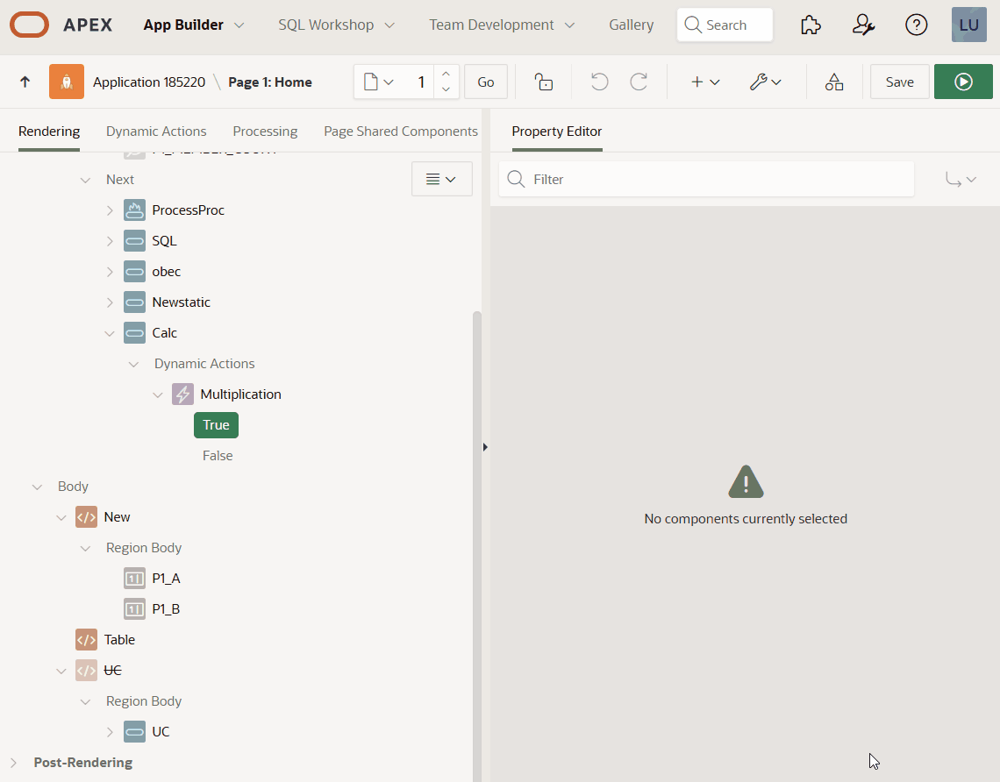

# Pretius Load JSON Object

An Oracle APEX Dynamic Action plugin that loads JSON data from various sources (SQL queries, PL/SQL procedures, or static JSON) into JavaScript variables accessible throughout your application.

## Preview


## Features

- **Multiple Data Sources**: Load JSON from SQL queries, JSON-returning SQL, PL/SQL procedures, or static JSON
- **Flexible Variable Naming**: Create nested JavaScript objects (e.g., `myApp.data`, `window.pageData`)
- **Auto-binding Support**: Submit page items to use in your SQL/PL/SQL code
- **Incremental Loading**: Option to preserve or replace existing object data
- **Post-load Execution**: Execute custom JavaScript after successful data load
- **Built-in Spinner**: Optional loading indicator during AJAX calls
- **Wait for Result**: Synchronous execution support with other dynamic actions

## Installation

### Import via APEX Builder

1. Navigate to **Shared Components** > **Plug-ins**
2. Click **Import**
3. Upload `dynamic_action_plugin_com_pretius_apex_load_json_object.sql`
4. Follow the import wizard

## Usage

### Basic Setup

1. Create a new **Dynamic Action** on your page
2. Select **Pretius Load JSON Object** as the action
3. Configure the plugin attributes:

### Configuration Attributes

| Attribute | Required | Description |
|-----------|----------|-------------|
| **Source** | Yes | Choose from: SQL Query, SQL Query Returning JSON Object, PL/SQL Procedure, or Static |
| **Load Into** | Yes | JavaScript variable path (e.g., `pageData`, `myApp.data`) |
| **Items to Submit** | No | Page items to submit to server (for dynamic queries) |
| **Remove Object before Load** | No | Whether to clear existing object before loading (default: Yes) |
| **Show Spinner** | No | Display loading spinner on triggering element (default: Yes) |
| **Execute JavaScript Code** | No | Custom JavaScript to run after successful load |

## Examples

### Example 1: Simple SQL Query

Load employee data from a table:

```sql
SELECT * FROM emp
```

**Resulting JSON structure:**
```json
[
    {
        "EMPNO": 7839,
        "ENAME": "KING",
        "JOB": "PRESIDENT",
        "HIREDATE": "1981-11-17T00:00:00Z",
        "SAL": 5000,
        "DEPTNO": 10
    },
    {
        "EMPNO": 7698,
        "ENAME": "BLAKE",
        "JOB": "MANAGER",
        "MGR": 7839,
        "HIREDATE": "1981-05-01T00:00:00Z",
        "SAL": 2850,
        "DEPTNO": 30
    }
]
```

**Access in JavaScript:**
```javascript
// Get first employee
var firstEmployee = pageData[0];

// Filter for specific employee
var record = pageData[0].filter(function(row) {
    return row.ENAME === 'BLAKE';
})[0];
```

> **Note:** Values over 4000 characters will be truncated. Use JSON SQL or PL/SQL for larger data.

---

### Example 2: SQL Query Returning JSON Object

Create a structured JSON array with custom field names:

```sql
SELECT json_arrayagg(
    json_object(
        'id'       value empno,
        'name'     value ename,
        'pay'      value sal
    )
) as employees
FROM emp
```

**Resulting JSON:**
```json
[
  {"id":7369, "name":"SMITH", "pay":800},
  {"id":7499, "name":"ALLEN", "pay":1600},
  {"id":7521, "name":"WARD", "pay":1250}
]
```

**Access in JavaScript:**
```javascript
// Get first employee
var firstEmployee = pageData[0];

// Filter for specific employee
var employees = Object.values(pageData);
var record = employees.filter(function(row) {
    return row.name === 'WARD';
})[0];
```

---

### Example 3: JSON Object Aggregation

Create a key-value pair object:

```sql
SELECT json_objectagg(dname value deptno) 
FROM dept
```

**Result:**
```json
{"ACCOUNTING":10, "RESEARCH":20, "SALES":30, "OPERATIONS":40}
```

**Access:**
```javascript
var accountingDeptNo = pageData.ACCOUNTING; // Returns 10
```

---

### Example 4: Nested JSON with Subqueries

Create departments with their employees:

```sql
SELECT json_arrayagg(
    json_object(
        'department_name' value d.dname,
        'department_no'   value d.deptno,
        'employees'       value (
            SELECT json_arrayagg(
                json_object(
                    'employee_number' value e.empno,
                    'employee_name'   value e.ename
                )
            )
            FROM emp e
            WHERE e.deptno = d.deptno
        )
    )
) as departments
FROM dept d
```

**Result:**
```json
[
  {
    "department_name": "ACCOUNTING",
    "department_no": 10,
    "employees": [
      {"employee_number": 7782, "employee_name": "CLARK"},
      {"employee_number": 7839, "employee_name": "KING"}
    ]
  }
]
```

---

### Example 5: PL/SQL Procedure with apex_json

Build complex JSON structures programmatically:

```plsql
DECLARE
    l_deptno dept.deptno%TYPE := 10;
    l_dept_row dept%ROWTYPE;
BEGIN
    apex_json.open_object; -- {

    SELECT d.*
    INTO l_dept_row
    FROM dept d
    WHERE d.deptno = l_deptno;

    apex_json.open_object('department'); -- department {
    apex_json.write('department_number', l_dept_row.deptno);
    apex_json.write('department_name', l_dept_row.dname);
 
    apex_json.open_array('employees'); -- employees: [
  
    FOR cur_rec IN (SELECT * FROM emp e WHERE e.deptno = l_deptno)
    LOOP
        apex_json.open_object; -- {
        apex_json.write('employee_number', cur_rec.empno);
        apex_json.write('employee_name', cur_rec.ename);
        apex_json.close_object; -- }
    END LOOP;

    apex_json.close_array; -- ]
    apex_json.close_object; -- }

    apex_json.open_object('metadata'); -- metadata {
    apex_json.write('published_date', to_char(sysdate, 'DD-MON-YYYY'));
    apex_json.write('publisher', 'My Company');
    apex_json.close_object; -- }
  
    apex_json.close_object; -- }
END;
```

---

### Example 6: Using Page Items in Queries

**Configuration:**
- **Items to Submit:** `P1_DEPARTMENT_ID`
- **Source:** SQL Query Returning JSON Object

```sql
SELECT json_arrayagg(
    json_object(
        'id'   value empno,
        'name' value ename
    )
)
FROM emp
WHERE deptno = :P1_DEPARTMENT_ID
```

The plugin automatically binds submitted page items to your query.

---

### Example 7: Static JSON

**Configuration:**
- **Source:** Static
- **JSON Object:**

```json
{
    "empNo": 7839,
    "ename": "Blake",
    "departments": ["Accounting", "Research", "Sales"]
}
```

---

### Example 8: Incremental Data Loading

Build up an object across multiple dynamic actions:

**Dynamic Action 1:**
- **Load Into:** `appData`
- **Remove Object before Load:** No (unchecked)
- **Static JSON:**
```json
{"section1": {"key1": "value1"}}
```

**Dynamic Action 2:**
- **Load Into:** `appData`
- **Remove Object before Load:** No (unchecked)
- **Static JSON:**
```json
{"section2": {"key2": "value2"}}
```

**Result:**
```javascript
appData = {
    section1: {key1: "value1"},
    section2: {key2: "value2"}
};
```

---

### Example 9: Post-Load JavaScript Execution

Refresh a region after loading data:

**Execute JavaScript Code (on success):**
```javascript
// Refresh a specific region
apex.region('employeeList').refresh();

// Update a chart
apex.region('salesChart').refresh();

// Log the loaded data
console.log('Data loaded:', window.pageData);

// Access dynamic action context
console.log('Triggered by:', this.triggeringElement);

// Display as a HTML table in element #myTable
const employees=pageData[0];let tableHTML='\n<table id="myTable" class="t-Report-report" border="1" style="border-collapse: collapse; width: 100%;">\n<thead><tr><th>EMPNO</th><th>ENAME</th><th>JOB</th><th>MGR</th><th>HIREDATE</th><th>SAL</th><th>COMM</th><th>DEPTNO</th></tr></thead>\n<tbody>';employees.forEach((t=>{const e=new Date(t.HIREDATE).toLocaleDateString();tableHTML+=`\n<tr>\n<td>${t.EMPNO}</td><td>${t.ENAME}</td><td>${t.JOB||""}</td><td>${t.MGR||""}</td>\n<td>${e}</td><td>${t.SAL}</td><td>${t.COMM||""}</td><td>${t.DEPTNO}</td>\n</tr>`})),tableHTML+="</tbody></table>",$("#myTable").replaceWith(tableHTML);
```

**Available Context Variables:**
- `this.triggeringElement` - DOM element that triggered the action
- `this.affectedElements` - jQuery object of affected elements
- `this.action` - Action object with attributes
- `this.browserEvent` - Browser event object
- `this.data` - Optional additional data

---

## Advanced Usage

### Accessing Loaded Data

Once loaded, access your data from any JavaScript context:

```javascript
// Direct access
var employee = pageData.row[0];

// From execute JavaScript code action
console.log(window.myApp.data);

// In item initialization JavaScript
apex.item('P1_EMPLOYEE_NAME').setValue(pageData.row[0].ENAME);
```

### Nested Object Paths

The plugin automatically creates nested objects:

```javascript
// Load Into: myApp.config.database
// Creates: window.myApp.config.database = { /* your data */ }
```

### Error Handling

Errors are logged to the browser console:

```
JSON Load Error for variable: window.pageData [error details]
```

Enable APEX debug mode for server-side debugging information.

## Technical Details

### Plugin Information
- **Type:** Dynamic Action
- **Category:** Execute
- **Package:** `com_pretius_apex_load_json_obj`

### Files Structure
```
plugin/
  ├── dynamic_action_plugin_com_pretius_apex_load_json_object.sql
  ├── db/
  │   ├── com_pretius_apex_load_json_object.pks
  │   └── com_pretius_apex_load_json_object.pkb
  └── server/
      └── pretiusLoadJSONObject.js
```

### Browser Compatibility
Compatible with all browsers supported by Oracle APEX.

### Performance Considerations
- Large datasets may impact page load time
- Consider pagination or lazy loading for extensive data
- SQL queries execute server-side, reducing client processing

## Troubleshooting

### Data Not Loading
1. Check browser console for errors
2. Enable APEX debug mode
3. Verify SQL/PL/SQL syntax
4. Ensure submitted page items exist
5. Check database permissions

### Data Truncated
- SQL Query source limits values to 4000 characters
- Use "SQL Query Returning JSON Object" or "PL/SQL Procedure" for CLOBs

### Object Not Accessible
- Verify the "Load Into" variable name
- Check that "Remove Object before Load" is configured correctly
- Ensure JavaScript code executes after plugin completes (use "Wait for Result")

## About

**Version:** 24.2.2  
**Author:** Pretius  
**GitHub:** [https://github.com/pretius/Pretius-Load-JSON-Object](https://github.com/pretius/Pretius-Load-JSON-Object)

## Version History

- 24.2.2 (January 2026)
  - Fix for "Remove Object before Load"
  - Fix for jsonsql error when no rows returned
  - Fix for assignments that fail causing inifinite spinner issue
  
- 24.2.1 (January 2026)
   - Initial Version


## License

Please refer to the license information in the GitHub repository.

## Support

For issues, questions, or contributions, please visit the GitHub repository.

## Credits

- https://github.com/stefandobre/Load-JSON-Object
